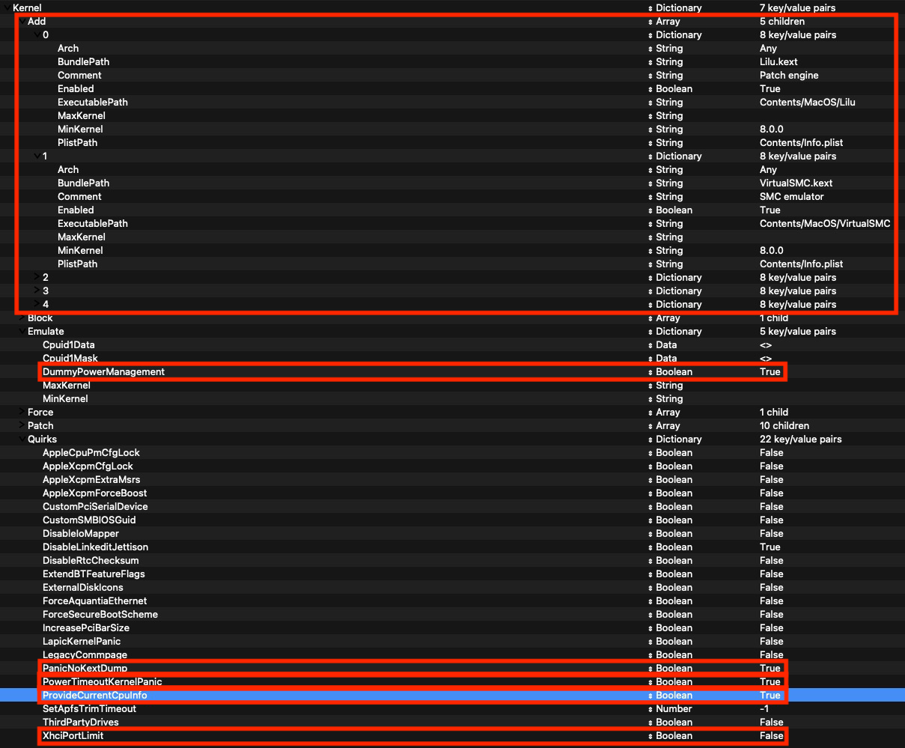
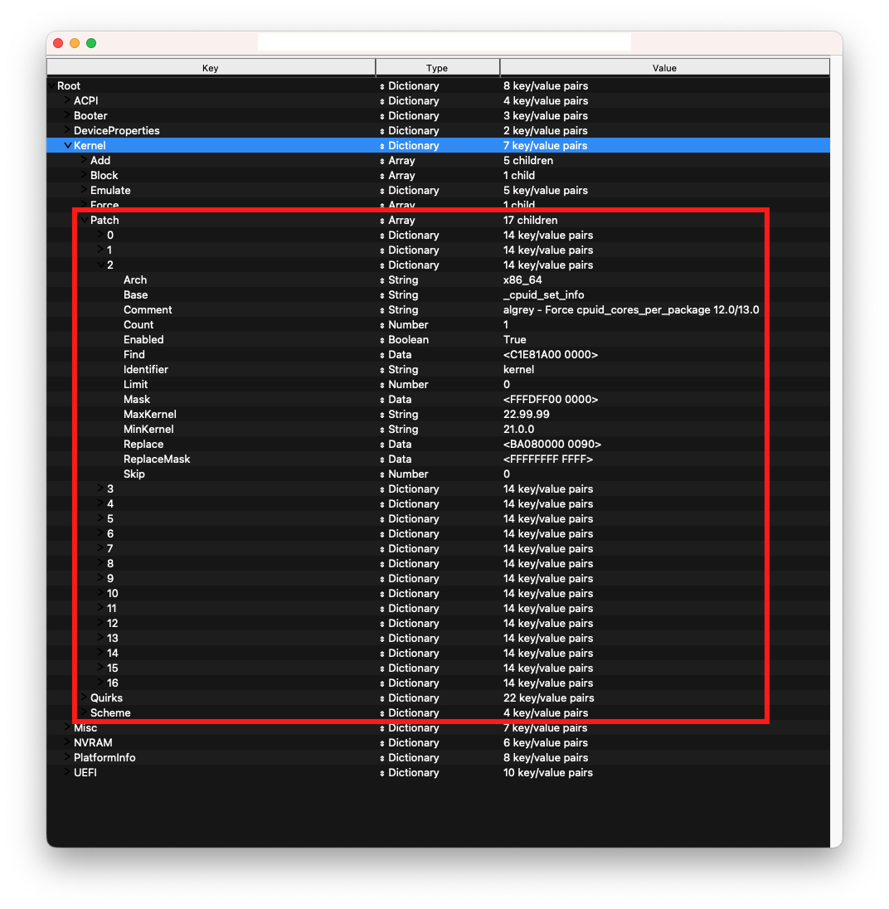
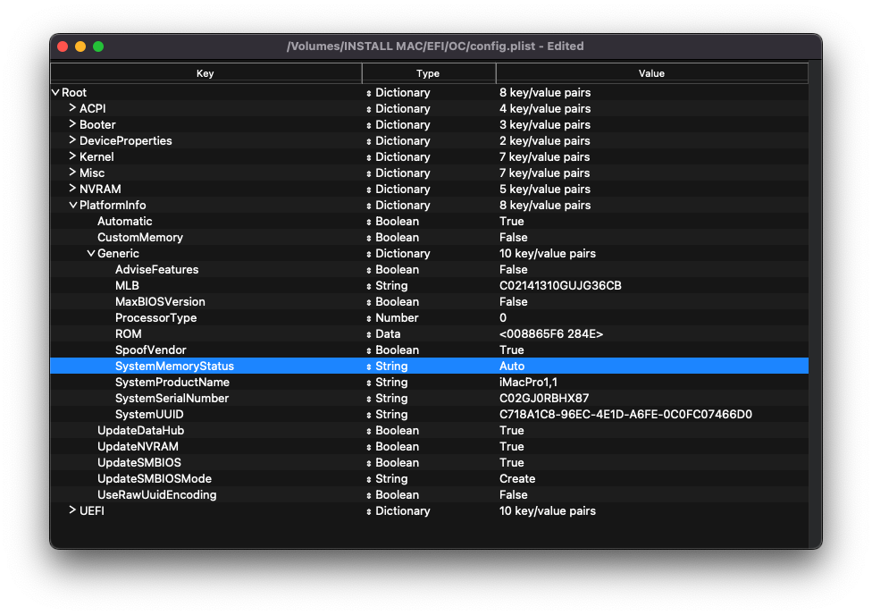

# Bulldozer(15h) and Jaguar(16h)

| Support | Version |
| :--- | :--- |
| Initial macOS Support | macOS 10.13, High Sierra |

## ACPI


### Add

::: tip Info

| Required SSDTs | Description |
| :--- | :--- |
| **[SSDT-EC-USBX](https://dortania.github.io/Getting-Started-With-ACPI/)** | Fixes both the embedded controller and USB power, see [Getting Started With ACPI Guide](https://dortania.github.io/Getting-Started-With-ACPI/) for more details. |

:::

## Booter


This section is dedicated to quirks relating to boot.efi patching with OpenRuntime, the replacement for AptioMemoryFix.efi

### Quirks

::: tip Info
Settings relating to boot.efi patching and firmware fixes, for us, we leave it as default
:::
::: details More in-depth Info

* **AvoidRuntimeDefrag**: YES
  * Fixes UEFI runtime services like date, time, NVRAM, power control, etc
* **EnableSafeModeSlide**: YES
  * Enables slide variables to be used in safe mode.
* **EnableWriteUnprotector**: YES
  * Needed to remove write protection from CR0 register.
* **ProvideCustomSlide**: YES
  * Used for Slide variable calculation. However the necessity of this quirk is determined by `OCABC: Only N/256 slide values are usable!` message in the debug log. If the message `OCABC: All slides are usable! You can disable ProvideCustomSlide!` is present in your log, you can disable `ProvideCustomSlide`.
* **SetupVirtualMap**: YES
  * Fixes SetVirtualAddresses calls to virtual addresses, required for Gigabyte boards to resolve early kernel panics
  
:::

## Kernel

| Kernel | Kernel Patches |
| :--- | :--- |
|  |  |

### Emulate

::: tip Info

Needed for spoofing unsupported CPUs like Pentiums and Celerons and to disable CPU power management on unsupported CPUs (such as AMD CPUs)

| Quirk | Enabled |
| :--- | :--- |
| DummyPowerManagement | YES |

:::

::: details More in-depth Info

* **Cpuid1Mask**: Leave this blank
  * Mask for fake CPUID
* **Cpuid1Data**: Leave this blank
  * Fake CPUID entry
* **DummyPowerManagement**: YES
  * New alternative to NullCPUPowerManagement, required for all AMD CPU based systems as there's no native power management. Intel can ignore
* **MinKernel**: Leave this blank
  * Lowest kernel version the above patches will be injected into, if no value specified it'll be applied to all versions of macOS. See below table for possible values
  * ex. `12.00.00` for OS X 10.8
* **MaxKernel**: Leave this blank
  * Highest kernel version the above patches will be injected into, if no value specified it'll be applied to all versions of macOS. See below table for possible values
  * ex. `11.99.99` for OS X 10.7

::: details Kernel Support Table

| OS X Version | MinKernel | MaxKernel |
| :--- | :--- | :--- |
| 10.4 | 8.0.0 | 8.99.99 |
| 10.5 | 9.0.0 | 9.99.99 |
| 10.6 | 10.0.0 | 10.99.99 |
| 10.7 | 11.0.0 | 11.99.99 |
| 10.8 | 12.0.0 | 12.99.99 |
| 10.9 | 13.0.0 | 13.99.99 |
| 10.10 | 14.0.0 | 14.99.99 |
| 10.11 | 15.0.0 | 15.99.99 |
| 10.12 | 16.0.0 | 16.99.99 |
| 10.13 | 17.0.0 | 17.99.99 |
| 10.14 | 18.0.0 | 18.99.99 |
| 10.15 | 19.0.0 | 19.99.99 |
| 11 | 20.0.0 | 20.99.99 |
| 12 | 21.0.0 | 21.99.99 |

:::

### Patch

This is where the AMD kernel patching magic happens. Please do note that `KernelToPatch` and `MatchOS` from Clover becomes `Kernel` and `MinKernel`/ `MaxKernel` in OpenCore, you can find pre-made patches by [AlGrey](https://amd-osx.com/forum/memberlist.php?mode=viewprofile&u=10918&sid=e0feb8a14a97be482d2fd68dbc268f97)(algrey#9303).

Kernel patches:

* [Bulldozer/Jaguar(15h/16h)](https://github.com/AMD-OSX/AMD_Vanilla/tree/master) (10.13, 10.14, 10.15, 11.x and 12.x)

To merge:

* Open both files,
* Delete the `Kernel -> Patch` section from config.plist
* Copy the `Kernel -> Patch` section from patches.plist
* Paste into where old patches were in config.plist


You will also need to modify three patches, all named `algrey - Force cpuid_cores_per_package`. You only need to change the `Replace` value only. You should change:

* `B8000000 0000` => `B8 <core count> 0000 0000`
* `BA000000 0000` => `BA <core count> 0000 0000`
* `BA000000 0090` => `BA <core count> 0000 0000`
 
Where `<core count>` is replaced with the physical core count of your CPU in hexadecimal. For example, an 8-Core 5800X would have the new Replace value be:

* `B8 08 0000 0000`
* `BA 08 0000 0000`
* `BA 08 0000 0090`

::: details Core Count => Hexadecimal Table

| Core Count | Hexadecimal |
| :--------- | :---------- |
| 4 Core | `04` |
| 6 Core | `06` |
| 8 Core | `08` |
| 12 Core | `0C` |
| 16 Core | `10` |
| 24 Core | `18` |
| 32 Core | `20` |
| 64 Core | `40` |

:::

### Quirks

::: tip Info

Settings relating to the kernel, for us we'll be enabling the following:

| Quirk | Enabled |
| :--- | :--- |
| PanicNoKextDump | YES |
| PowerTimeoutKernelPanic | YES |
| ProvideCurrentCpuInfo | YES |
| XhciPortLimit | YES |

:::

::: details More in-depth Info

* **AppleCpuPmCfgLock**: NO
  * Only needed when CFG-Lock can't be disabled in BIOS. AMD users can ignore
* **AppleXcpmCfgLock**: NO
  * Only needed when CFG-Lock can't be disabled in BIOS. AMD users can ignore
* **AppleXcpmExtraMsrs**: NO
  * Disables multiple MSR access needed for unsupported CPUs like Pentiums and certain Xeons
* **CustomSMBIOSGuid**: NO
  * Performs GUID patching for UpdateSMBIOSMode set to `Custom`. Usually relevant for Dell laptops
  * Enabling this quirk in tandem with `PlatformInfo -> UpdateSMBIOSMode -> Custom` will disable SMBIOS injection into "non-Apple" OSes however we do not endorse this method as it breaks Bootcamp compatibility. Use at your own risk.
* **DisableIoMapper**: NO
  * AMD doesn't have DMAR or VT-D support so irrelevant
* **DisableLinkeditJettison**: YES
  * Allows Lilu and others to have more reliable performance without `keepsyms=1`
* **DisableRtcChecksum**: NO
  * Prevents AppleRTC from writing to primary checksum (0x58-0x59), required for users who either receive BIOS reset or are sent into Safe mode after reboot/shutdown
* **ExtendBTFeatureFlags** NO
  * Helpful for those having continuity issues with non-Apple/non-Fenvi cards
* **LapicKernelPanic**: NO
  * Disables kernel panic on AP core lapic interrupt, generally needed for HP systems. Clover equivalent is `Kernel LAPIC`
* **LegacyCommpage**: NO
  * Resolves SSSE3 requirement for 64 Bit CPUs in macOS, mainly relevant for 64-Bit Pentium 4 CPUs(ie. Prescott)
* **PanicNoKextDump**: YES
  * Allows for reading kernel panics logs when kernel panics occur
* **PowerTimeoutKernelPanic**: YES
  * Helps fix kernel panics relating to power changes with Apple drivers in macOS Catalina, most notably with digital audio.
* **ProvideCurrentCpuInfo**: YES
  * Provides the kernel with CPU frequency values for AMD.
* **SetApfsTrimTimeout**: `-1`
  * Sets trim timeout in microseconds for APFS filesystems on SSDs, only applicable for macOS 10.14 and newer with problematic SSDs.
* **XhciPortLimit**: YES
  * This is actually the 15 port limit patch, don't rely on it as it's not a guaranteed solution for fixing USB. A more proper solution for AMD can be found here: [AMD USB Mapping](https://dortania.github.io/OpenCore-Post-Install/usb/)
:::

## PlatformInfo



::: tip Info

For setting up the SMBIOS info, we'll use CorpNewt's [GenSMBIOS](https://github.com/corpnewt/GenSMBIOS) application.

For this example, we'll choose the iMacPro1,1 SMBIOS but some SMBIOS play with certain GPUs better than others:

* iMacPro1,1: AMD RX Polaris and newer
* MacPro7,1: AMD RX Polaris and newer
  * Note that MacPro7,1 is exclusive to macOS 10.15, Catalina and newer
* MacPro6,1: AMD R5/R7/R9 and older
* iMac14,2: Nvidia Kepler and newer
  * Note: iMac14,2 is only supported to macOS 10.8-10.15, for macOS 11, Big Sur and newer please use MacPro7,1

Run GenSMBIOS, pick option 1 for downloading MacSerial and Option 3 for selecting out SMBIOS.  This will give us an output similar to the following:

```sh
  #######################################################
 #              iMacPro1,1 SMBIOS Info                 #
#######################################################

Type:         iMacPro1,1
Serial:       C02YX0TZHX87
Board Serial: C029269024NJG36CB
SmUUID:       DEA17B2D-2F9F-4955-B266-A74C47678AD3
```

The order is `Product | Serial | Board Serial (MLB)`

The `Type` part gets copied to Generic -> SystemProductName.

The `Serial` part gets copied to Generic -> SystemSerialNumber.

The `Board Serial` part gets copied to Generic -> MLB.

The `SmUUID` part gets copied to Generic -> SystemUUID.

We set Generic -> ROM to either an Apple ROM (dumped from a real Mac), your NIC MAC address, or any random MAC address (could be just 6 random bytes, for this guide we'll use `11223300 0000`. After install follow the [Fixing iServices](https://dortania.github.io/OpenCore-Post-Install/universal/iservices.html) page on how to find your real MAC Address)

**Reminder that you want either an invalid serial or valid serial numbers but those not in use, you want to get a message back like: "Invalid Serial" or "Purchase Date not Validated"**

[Apple Check Coverage page](https://checkcoverage.apple.com)

**Automatic**: YES

* Generates PlatformInfo based on Generic section instead of DataHub, NVRAM, and SMBIOS sections

:::

### Generic

::: details More in-depth Info

* **AdviseFeatures**: NO
  * Used for when the EFI partition isn't first on the Windows drive

* **MaxBIOSVersion**: NO
  * Sets BIOS version to Max to avoid firmware updates in Big Sur+, mainly applicable for genuine Macs.

* **ProcessorType**: `0`
  * Set to `0` for automatic type detection, however this value can be overridden if desired. See [AppleSmBios.h](https://github.com/acidanthera/OpenCorePkg/blob/master/Include/Apple/IndustryStandard/AppleSmBios.h) for possible values

* **SpoofVendor**: YES
  * Swaps vendor field for Acidanthera, generally not safe to use Apple as a vendor in most case

* **SystemMemoryStatus**: Auto
  * Sets whether memory is soldered or not in SMBIOS info, purely cosmetic and so we recommend `Auto`

* **UpdateDataHub**: YES
  * Update Data Hub fields

* **UpdateNVRAM**: YES
  * Update NVRAM fields

* **UpdateSMBIOS**: YES
  * Updates SMBIOS fields

* **UpdateSMBIOSMode**: Create
  * Replace the tables with newly allocated EfiReservedMemoryType, use `Custom` on Dell laptops requiring `CustomSMBIOSGuid` quirk
  * Setting to `Custom` with `CustomSMBIOSGuid` quirk enabled can also disable SMBIOS injection into "non-Apple" OSes however we do not endorse this method as it breaks Bootcamp compatibility. Use at your own risk

:::

## UEFI


### Quirks

::: tip Info
Relating to quirks with the UEFI environment, for us we'll be changing the following:

| Quirk | Enabled | Comment |
| :--- | :--- | :--- |
| UnblockFsConnect | NO | Needed mainly by HP motherboards |

:::

::: details More in-depth Info

* **DisableSecurityPolicy**: NO
  * Disables platform security policy in firmware, recommended for buggy firmwares where disabling Secure Boot does not allow 3rd party firmware drivers to load.
  * If running a Microsoft Surface device, recommended to enable this option

* **RequestBootVarRouting**: YES
  * Redirects AptioMemoryFix from `EFI_GLOBAL_VARIABLE_GUID` to `OC_VENDOR_VARIABLE_GUID`. Needed for when firmware tries to delete boot entries and is recommended to be enabled on all systems for correct update installation, Startup Disk control panel functioning, etc.

* **UnblockFsConnect**: NO
  * Some firmware block partition handles by opening them in By Driver mode, which results in File System protocols being unable to install. Mainly relevant for HP systems when no drives are listed

:::

## AMD BIOS Settings

* Note: Most of these options may not be present in your firmware, we recommend matching up as closely as possible but don't be too concerned if many of these options are not available in your BIOS

### Disable

* Fast Boot
* Secure Boot
* Serial/COM Port
* Parallel Port
* Compatibility Support Module (CSM)(**Must be off, GPU errors like `gIO` are common when this option in enabled**)

### Enable

* Above 4G decoding(**This must be on, if you can't find the option then add `npci=0x2000` to boot-args. Do not have both this option and npci enabled at the same time**)
* EHCI/XHCI Hand-off
* OS type: Windows 8.1/10 UEFI Mode
* SATA Mode: AHCI

# Now with all this done, head to the [cleaning up Config.plist page](/config.plist/secureboot.md)
